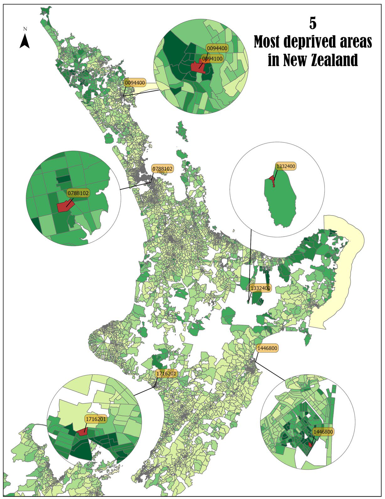
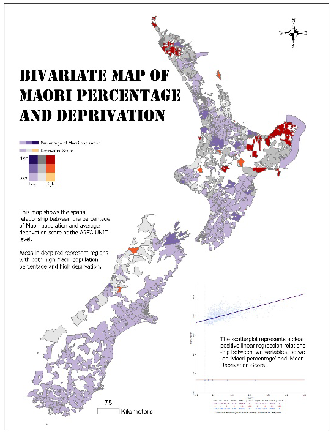
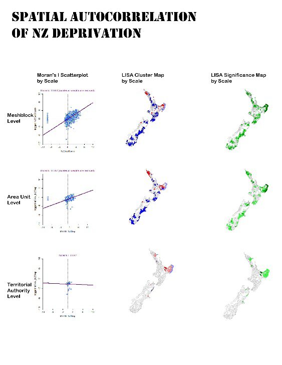

# esda-nz-deprivation
Exploratory Spatial Data Analysis of NZ Deprivation Index using ArcGIS Pro &amp; GeoDa (Moran’s I, LISA hotspot mapping).
# Spatial Autocorrelation of NZ Deprivation (Lab 1)

This project explores the spatial distribution of deprivation across New Zealand using **Exploratory Spatial Data Analysis (ESDA)** techniques.  
The analysis applies **Global Moran’s I** and **Local Indicators of Spatial Association (LISA)** at multiple geographic scales (meshblock, area unit, territorial authority).  
It highlights areas of concentrated disadvantage and their statistical significance, supporting evidence-based urban and social policy.

---

## 📊 Objectives
- Demonstrate ability to make a convincing cartographic argument using thematic maps.  
- Acquire and process statistical datasets to support spatial analysis.  
- Apply spatial analysis methods such as **Moran’s I** and **LISA**.  
- Develop cartographic design proficiency in **ArcGIS Pro** and **Adobe Illustrator**.  
- Tell a compelling visual story about deprivation and inequality in NZ.  

---

## 🛠️ Methods
- **Data**: NZ Deprivation Index (NZDep) at meshblock and area unit levels.  
- **Techniques**:  
  - Global Moran’s I to measure overall clustering of deprivation.  
  - LISA cluster maps to detect hot-spots and outliers.  
  - Bivariate mapping to explore correlation with Māori population percentage.  
- **Software**: ArcGIS Pro, Adobe Illustrator.  

---

## 🗺️ Results

### Top 5 Most Deprived Areas in New Zealand

### Bivariate Map – Māori Population % and Deprivation

### Spatial Autocorrelation at Multiple Scales

---

## 📄 Citation
Wang, W. (2025). *Spatial Autocorrelation of NZ Deprivation*. University of Canterbury, Lab 1.  

---

## 📂 Repository Structure
